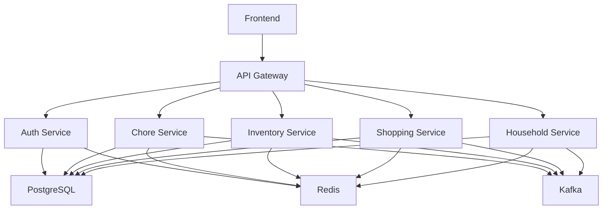

# System Patterns

## Architecture Overview

The Home Organization System follows a microservices architecture pattern, with each service responsible for a specific domain of functionality.

### Core Services

1. **Authentication Service (NestJS)**
   - User authentication and authorization
   - JWT token management
   - OAuth2 integration
   - Role-based access control
   - Session management

2. **Chore Management Service (Node.js/Express)**
   - Task creation and management
   - Assignment and scheduling
   - Status tracking
   - Notification handling
   - History and reporting

3. **Inventory Service (Python/FastAPI)**
   - Item tracking
   - Stock management
   - Alert generation
   - Category management
   - Location tracking

4. **Shopping Service (.NET Core)**
   - List management
   - Instacart integration
   - Price tracking
   - Order history
   - Shopping analytics

5. **Household Service (Node.js/Express)**
   - Household management
   - Member management
   - Activity tracking
   - Settings management
   - Household analytics

## Design Patterns

### 1. Event-Driven Architecture
- Kafka for event streaming
- Event sourcing for state changes
- CQRS for read/write separation
- Eventual consistency model
- Real-time updates

### 2. Microservices Patterns
- Service discovery
- Circuit breaker
- API gateway
- Bulkhead
- Retry with exponential backoff

### 3. Data Patterns
- CQRS for complex queries
- Event sourcing for audit
- Saga pattern for transactions
- Materialized views for reporting
- Caching strategies

### 4. Security Patterns
- JWT authentication
- OAuth2 authorization
- Role-based access control
- API key management
- Rate limiting

## Component Relationships

### Service Communication

### Data Flow
1. **User Actions**
   - Frontend requests
   - API Gateway routing
   - Service processing
   - Event publishing
   - State updates

2. **System Events**
   - Event generation
   - Kafka streaming
   - Service consumption
   - State synchronization
   - Notification dispatch

3. **Data Persistence**
   - Primary data in PostgreSQL
   - Cache in Redis
   - Events in Kafka
   - File storage for attachments
   - Logs in ELK stack

## Technical Decisions

### 1. Technology Stack
- Frontend: React (Next.js) with TypeScript
- Backend: Multiple services with specialized tech
- Database: PostgreSQL
- Cache: Redis
- Message Queue: Kafka
- Container: Docker
- Orchestration: Kubernetes

### 2. Development Practices
- Git flow branching
- Conventional commits
- Automated testing
- CI/CD pipelines
- Code review process

### 3. Monitoring & Logging
- Prometheus metrics
- Grafana dashboards
- ELK stack for logs
- Distributed tracing
- Health checks

### 4. Security Measures
- HTTPS everywhere
- API authentication
- Data encryption
- Input validation
- Security headers

## Best Practices

### 1. Code Organization
- Domain-driven design
- Clean architecture
- SOLID principles
- DRY principle
- KISS principle

### 2. Testing Strategy
- Unit testing
- Integration testing
- E2E testing
- Performance testing
- Security testing

### 3. Documentation
- API documentation
- Architecture diagrams
- Code comments
- README files
- Wiki pages

### 4. Deployment
- Infrastructure as Code
- Blue-green deployment
- Canary releases
- Rollback procedures
- Disaster recovery 